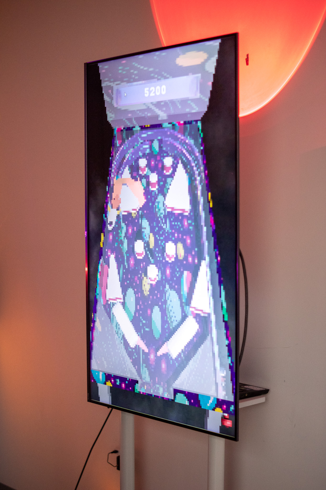

#### Obi Bernstein, Blaise Marino, Kassie O'hern
##### IMM 406 Prototyping For Advanced Systems  
##### Fall 2024  
##### Final Prototype  

This prototype is a pinball game where the users play as the paddles. This prototype is a collaborative game where the aim is to get the highest score. The difference between our pinball and normal pinball is that to use the paddles you have to lift a giant version of them yourself. This creates a novel interaction that immerses the players further into the game.

[Pinballahs Gameplay](https://youtube.com/shorts/yzHjiWs9pg0?feature=share)

##### Showcase Images

  
  
  
  
  
  